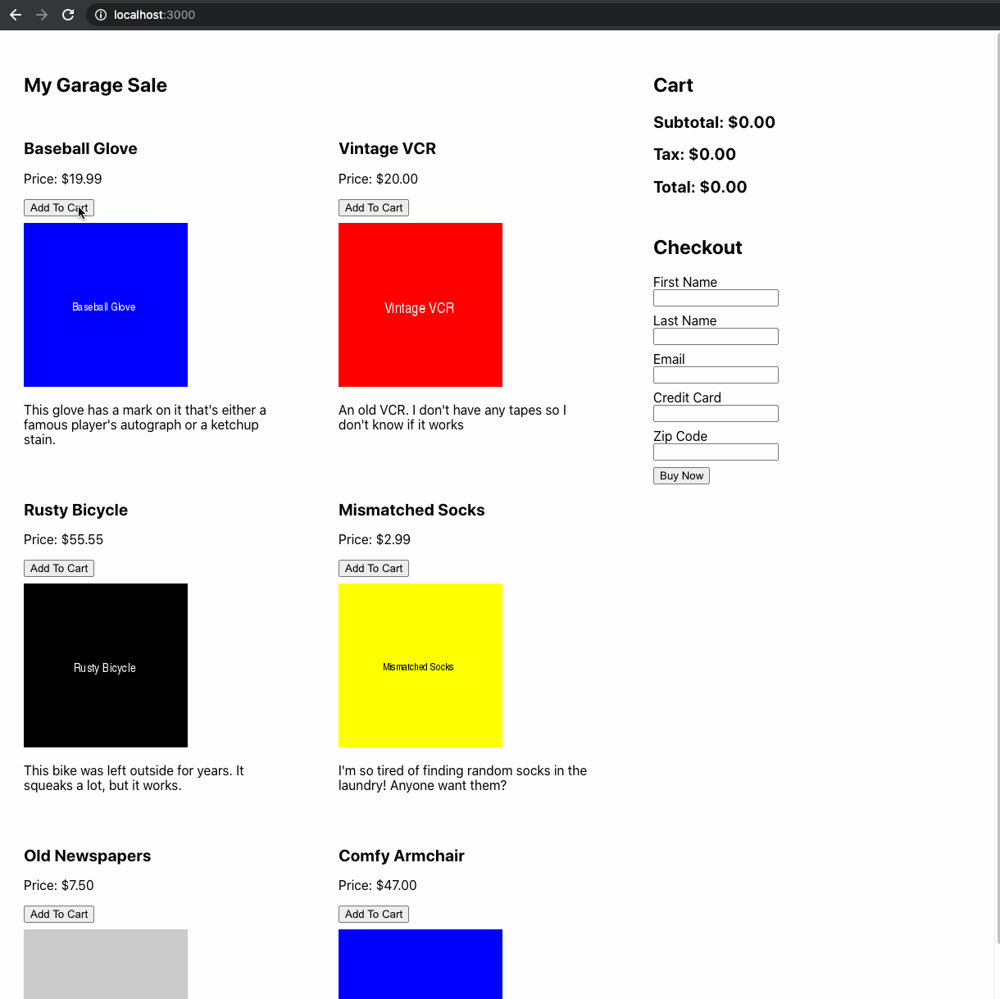

# Module Three Mid Module Assessment: Garage Sale App

## Getting Started

- Fork this repo
- Clone the forked repository
- `cd` to the directory where you cloned it
- `npm install` to install dependencies
- `npm test` to open the cypress testing window

> _Note_: Remember to `git add`, `git commit` and `git push` regularly

## Submission Guidelines

- When finished, commit and push your work.
- Make a pull request on github.
- Submit the link to your pull request on Canvas.

## Assessment Details

Create a garage sale app that meets the main user stories below.

1. I can see sections with products, shopping cart, and checkout form.
1. I can see each product's name, price, photo, description, and an `Add To Cart` button.
1. I can add products to my cart and see the subtotal, tax, and total update.
1. I can submit the checkout form, complete my purchase, and see a confirmation alert with the total cost.
1. If I do not complete the checkout form with valid data, I will see an alert that tells me my data is not valid.

## Acceptance criteria and tests

The acceptance criteria below are covered by unit tests.

### **`layout.test.js`**: `I can see sections with...`

- I can see a section with products laid out in a grid.
- I can see a `Cart` section that has `Subtotal`, `Tax`, and `Total`
- I can see a `Checkout` section that has inputs for `First Name`, `Last Name`, `Email`, `Credit Card`, `Zip Code`, and a button that says `Buy Now`
- The Cart and Checkout sections appear to the right of the products grid.

### **`product.test.js`**: `I can see each product's name...`

- Each product displays the name, photo, and description.
- Each product displays a price formatted in dollars and cents.
- Each product has an `Add To Cart` button.

### **`addToCart.test.js`**: `I can add products to my cart...`

- When I click on a product, its name appears in the cart.
- When I click on a product, its formatted price appears in the cart.
- When I click on a product, the subtotal updates with the sum of the prices of the items in the cart.
- When I click on a product, the tax updates to be 5% of the subtotal and is formatted in dollars and cents.
- When I click on a product, the total updates to be the sum of the subtotal and tax, and is formatted in dollars and cents.
- When I click on additional products, the other items in the cart do not change.
- When I click on additional products, the subtotal, tax, and total update accordingly.

### **checkout.test.js**: `I can submit the checkout form...`

- I can complete the inputs in the checkout form.
- When I complete the form with valid input and click `Buy Now`, an alert tells me the purchase was successful.
- When I complete the form with valid input and click `Buy Now`, an alert tells me the total amount I will be charged.
- When I complete the form but a piece of data is missing, an alert tells me that my input is not valid.
- When I complete the form but the credit card is not 16 digits long, an alert tells me `Credit card number is not valid.`
- When I complete the form but the zip code is not 5 digits long, an alert tells me `Zip code is not valid.`

## Help and tips

- Before you write any code, think about your component structure.
  - What components will you need to represent the parts of the app?
  - Which components will need to have state?
  - Which components will need to know about the state of **other components**?
  - Which components will need to get props (data or callbacks) from another component?
  - Which components will be rendered by other components?
  - Draw out your component structure. Check your drawing against the user stories. Will you be able to implement all of the stories with this structure?
- The products for the store are in the array in `data/productData.js`. You can import this and pass it to your components.
- There is a `formatPrice()` function you can import from `helpers/formatPrice` that will format prices in dollars and cents.
